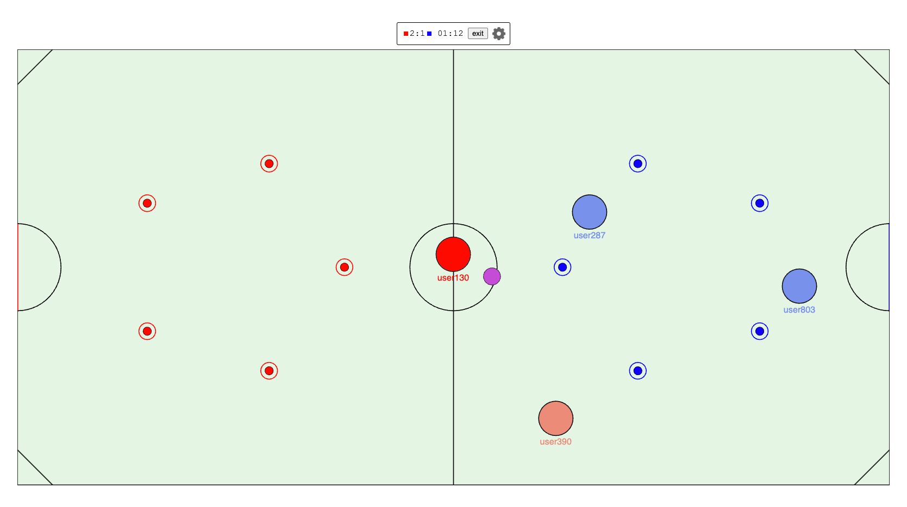
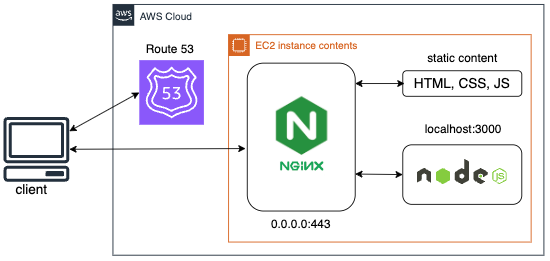

# Multiplayer Online Game Using Real-Time Technology

## Introduction
This project considers the creation of an adaptive browser-based air hockey game that allows players to interact in real-time over the Internet.

## Table of contents
- [Introduction](#introduction)
- [Deployment](#deployment)
- [Development testing](#development-testing)

## Introduction

The browser-based multiplayer game is a combination of two popular sports - air hockey and football - in the form of a 2D arcade game. The game has a minimalist design that is adaptive to all devices. The main purpose of the game is to score a goal against the opposing team. The winner is determined by the number of goals or until a certain number of goals are scored within a set time.
Players use the WASD keys to move their characters forward, backward, left and right across the playing field.
By pressing the space bar, players can kick the ball. The direction of the kick depends on the player's position relative to the ball.



## Deployment
### Prerequisites
- Node.js v20.x.x
  
### Project architecture


### Steps
1. Connect to the Linux machine, update software packages and create directories where the project will be located:
  ```
  ssh -i [path to .pem] [user]@[ip]
  sudo apt update
  sudo apt upgrade -y
  mkdir ~/pulseioGame
  mkdir ~/puseioGame/server
  mkdir ~/pulseioGame/client
  ```
2. Copy a local project to a virtual machine:
  ```
  scp -i [path to .pem] -r [path to project]/server/* [user]@[ip]:~/pulseioGame/server/
  scp -i [path to .pem] -r [path to project]/client/* [user]@[ip]:~/pulseioGame/client/
  ```
3. Node.js and dependencies installation:
  ```
  curl -fsSL https://deb.nodesource.com/setup_20.x -o ~/nodesource_setup.sh
  sudo -E bash nodesource_setup.sh
  sudo apt-get install -y nodejs
  cd ~/pulseioGame/server && npm install
  ```
4. Server launch:
  ```
  sudo npm install pm2 -g
  pm2 start ~/pulseioGame/server/index.js --name pulseio --watch --max-memory-restart 300M
  pm2 startup
  [copy the command output from previous command and run it]
  pm2 save
  ```
5. Webpack:
  ```
  cd ~/pulseioGame/client && npm i
  npx webpack
  ```
6. Nginx setup:
  ```
  sudo apt install nginx -y
  sudo systemctl enable nginx
  sudo cp ~/pulseioGame/server/nginx.conf /etc/nginx/sites-available/[domain name]
  sudo cp ~/pulseioGame/client/dist /var/www
  sudo ln -s /etc/nginx/sites-available/[domain name] /etc/nginx/sites-enabled/
  systemctl restart nginx
  ```
7. SSL/TLS certificate installation (domain name required):
  ```
  sudo snap install --classic certbot
  sudo ln -s /snap/bin/certbot /usr/bin/certbot
  sudo certbot --nginx
  ```

## Development testing

1. Download Node.js (v20.x.x) from the official website: https://nodejs.org/en/download
2. Ensure that Node.js and npm are installed:
  ```
  node -v
  npm -v
  ```
3. Set up the Server:
  ```
  cd [path to project]/server
  npm install
  DEVELOPMENT=true PORT=[port number] node index.js
  ```
4. Set up the Client:
  ```
  cd [path to project]/client
  npm install
  npx webpack
  ```

5. Open the browser and go to http://localhost:[port number]
